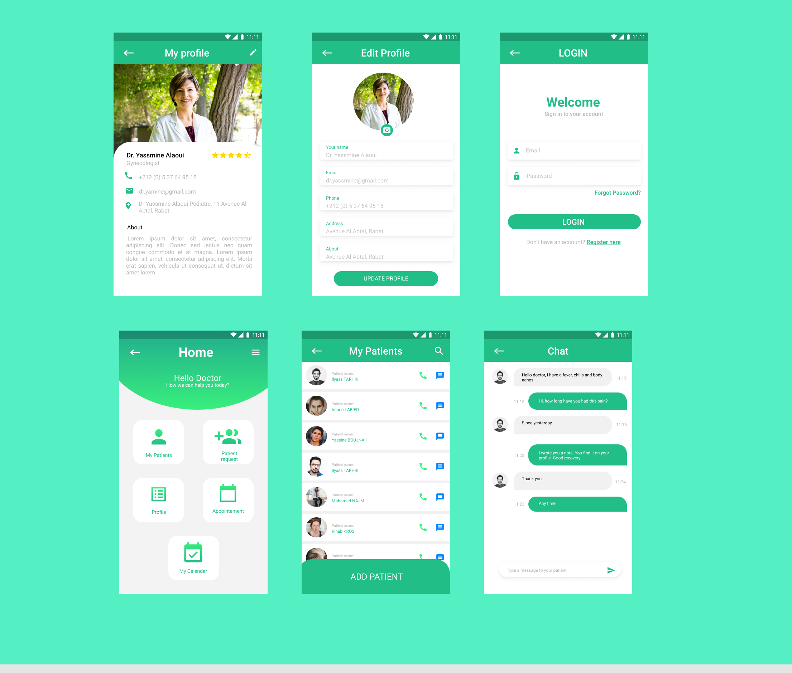
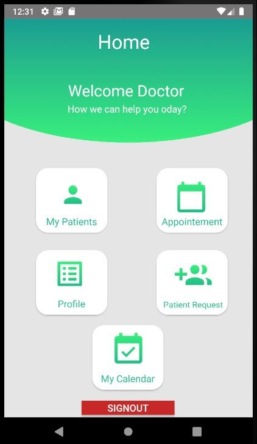
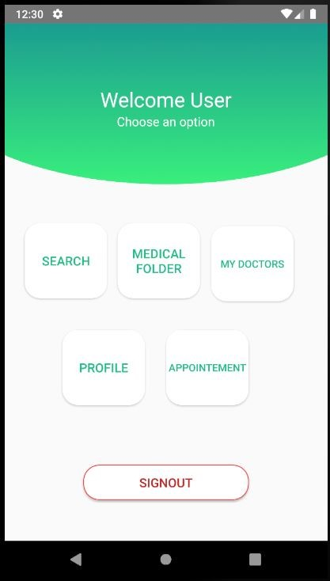
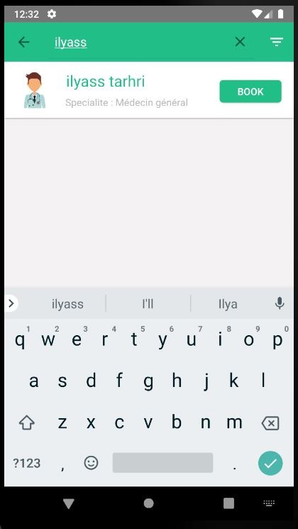
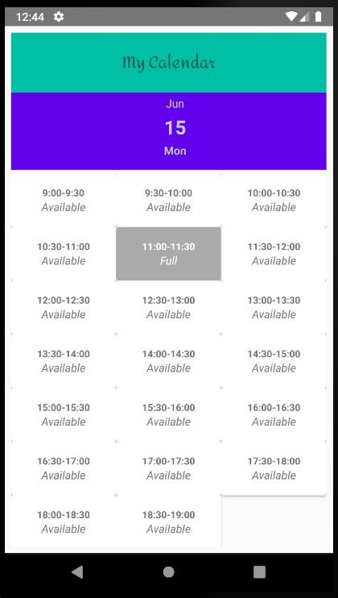
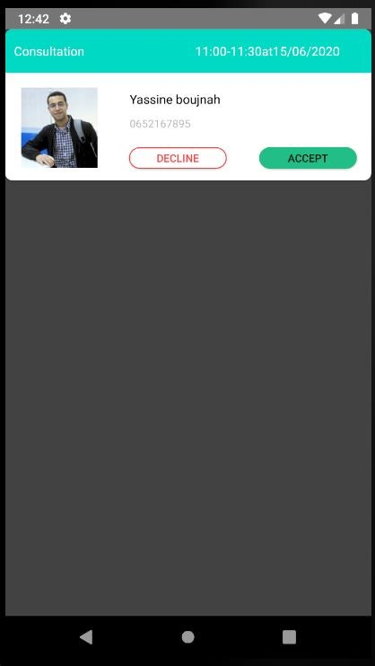
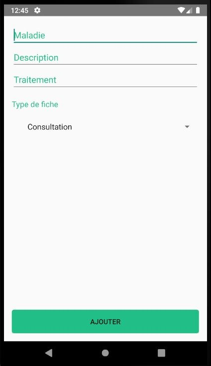
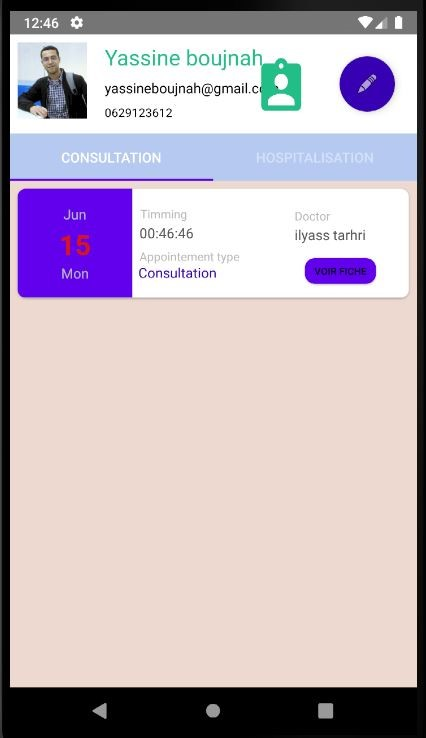

## HealthCare App
A mobile application that facilitates making appointments and monitoring patients.

## 🤓 Authors
**Yassine Boujnah** 
**Ilyass TARHRI** 

Figma [UI design](https://www.figma.com/file/L0xzd81wOR54JDfknXAZaR/HealthCare?node-id=0%3A1)

## Screenshots

  Doctor Home                 |    Patient Home        | Search Doctor
:-------------------------:|:-------------------------:|:-------------------------:
||

  Find Appointement                 |    Select Appointement        | Accept Appointement
:-------------------------:|:-------------------------:|:----------------------
|)|

  Add Treatment                |    Medical Folder        | Contact
:-------------------------:|:-------------------------:|:----------------------
||

